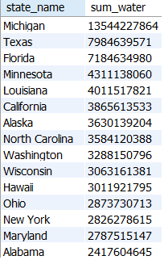

# SQL Project: US Household Income

### Data Cleaning and Exploratory Analysis

#### by Alex Melino

#

### Background and Data Information

This is a sample project intended to showcase SQL data cleaning and analysis skills. This dataset used real data and is provided by [AnalystBuilder.com](https://www.analystbuilder.com/) via the US Government. 

The data includes two tables which can both be found in the main directory of this repo under the names 'USHouseholdIncome.cs'v' and 'USHouseholdIncome_Statistics.csv'. These are the unaltered original data files. Both datasets contain over 32,000 lines of data relating to all the states and municipalities of the United States. The 'USHouseholdIncome_Statistics.csv' file contains the information relating to mean and median income as well as standard deviation, while the 'USHouseholdIncome.csv' file contains further geographical information. Both tables are linked by a common 'id' column.

The project is broken into two parts, with the first being the data cleaning process and the second being the exploratory data analysis section.

#

### Data Cleaning

For this project, only one dataset required cleaning, the USHouseholdIncome.csv file. The data required a series of data cleaning steps to ensure that the exploratory data analysis would yield accurate results. The end result can be found in the main directory of this repo under the name 'us_household_income_cleaned.csv'. 

The SQL code for the data cleaning queries is also located in the main directory of this repo under the name 'data-cleaning.sql'. The data cleaning process was somewhat straightforward as the data was in relatively good order. The main steps taken in this data cleaning example are as follows:

- The first step was to identify duplicate rows using the id column. By using their associated 'row_id' values, they were removed from the dataset. The other dataset contained no duplicate rows.

- The second step was to standardize the state names. A 'GROUP BY' function was used to identify spelling errors within the state names. Two errors were found in the Alabama and Georgia sections of the data. These were then corrected.

- A blank value was found in the 'place' column and that was populated with the appropriate value of 'Autaugaville'.

- Next the 'type' column was analyzed. It was determined that there were some spelling errors there. Some 'CPD' values were changed to the correct 'CDP' instead, and some spelling errors on the entries labelled 'Borough' were corrected.

- The final step was to check to ensure that no '0' values existed for both the land area and water area for any municipality as that would have been impossible. There were no values to correct here.

#

### Exploratory Data Analysis

In this phase, a variety of SQL queries were used to drill down into the data and present some outputs that convey more general information that could be useful to a user. The following were the steps takes and samples of their outputs (the full outputs can be found in the 'eda-outputs' folder of this repo):

1. The first step taken was to output the top states by land area and by water area. This was done with a 'SUM' statement and a simple 'GROUP BY' clause. These are some samples of the outputs:

2. The next step was to 'JOIN' the tables along their common 'id' column. From there the goal was to rank the states by their average mean income. This was achieved with specific 'ORDER BY' and 'GROUP BY' statements. The following is a sample of the outputs for both the top 5 and bottom 5 states by average mean income:

3. The next step was similar but instead it grouped by the type of municipality and ranked the mean income from high to low based on the type of classification for that area. The output also included a 'count' of the number of entries for each type. The following is the output:

4. Continuing with the theme of the previous two steps, the final step explored the average mean income with respect to each city, once again using 'JOIN', 'GROUP BY', and 'ORDER BY' statements. The following is the top 10 and bottom 10 cities and their respective states for average mean income:

#

### Next Steps for Further Analysis

The exploratory data analysis phase lacked some direction as this particular project was open ended and did not have a goal. With more precise direction, a plethora of data could be retrieved from a dataset of this size.

Clarification on units used for some of the data would be helpful, for example, the land and water area of each municipality. Also, clarification on what each 'type' of municipality means would be helpful for an analyst to better understand the dataset.

Geographical data regarding latitude and longitude is included in the table, so some visualization that includes a map would be beneficial. Additional software such as Power BI, Excel, or Tableau would be very useful to help visualize the data or create strategic reports.